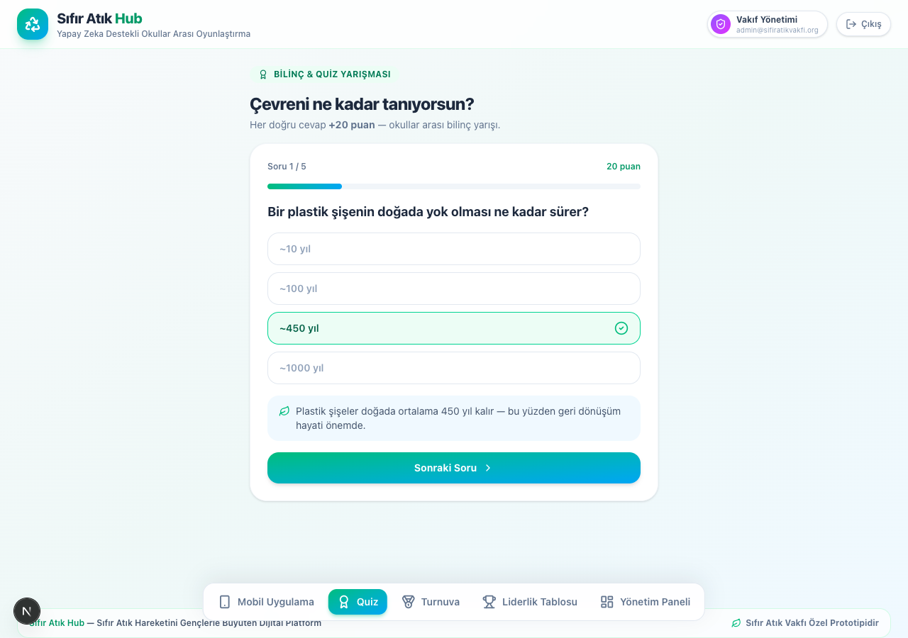
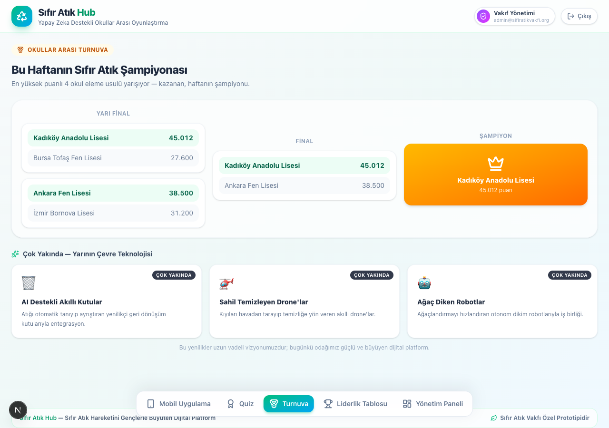
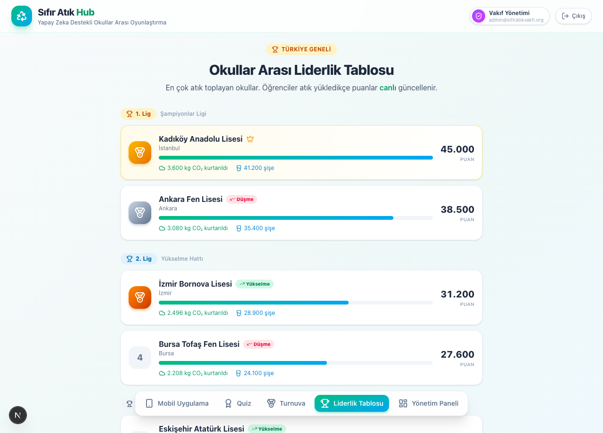

# Sıfır Atık Hub

**An AI-powered, gamified zero-waste platform that turns a national sustainability initiative into measurable youth engagement.**

Sıfır Atık Hub is a working prototype designed and engineered for Turkey's *Sıfır Atık* (Zero Waste) movement. Students photograph their waste, the system recognises it, and every action is converted into points, CO₂ savings and inter-school competition — while a foundation-level dashboard turns thousands of small actions into auditable national data.

🔗 **Live demo:** https://sifir-atik-proje.vercel.app
🎯 **Built for:** presentation to the Sıfır Atık Vakfı (Zero Waste Foundation)

> **Stack:** Next.js 16 (App Router) · React 19 · TypeScript · Tailwind CSS v4

---

## Screens

| Student & Quiz | Inter-school Tournaments | Foundation Leaderboard |
| :---: | :---: | :---: |
|  |  |  |

---

## The problem it solves

In schools, zero-waste awareness rarely becomes a habit: activity is recorded on paper, nothing is measurable, and there is no mechanism to keep young people engaged or to compare performance between schools. Sıfır Atık Hub closes that gap with a single product that serves four stakeholders at once — students, schools, corporate sponsors and the foundation.

## Key features

- **Camera-based waste recognition** — a one-tap flow classifies waste type (plastic, glass, metal, paper) and instantly converts it into points and environmental impact.
- **Gamification engine** — recycling plus higher-value missions (tree planting, coastal clean-up), an awareness **quiz** with a randomised question bank, and **inter-school tournaments** (a zero-waste championship bracket alongside sports events with a live participant counter).
- **Competitive leaderboard** — schools are organised into **league tiers (1st / 2nd / 3rd)** with promotion and relegation indicators, mirroring real sporting competition to drive participation.
- **Role-based access control** — four distinct roles (student, school, corporate, foundation) each see a scoped set of tabs from a single codebase.
- **Foundation analytics dashboard** — aggregated, real-time metrics: CO₂ avoided, bottles recycled, waste-type distribution and regional breakdown, with a live activity feed.
- **Measurable impact** — every interaction is translated into concrete figures (CO₂, bottles, trees, coastal waste) suitable for transparent, auditable reporting.

## Architecture & technical highlights

- **Single-page, client-rendered application** built on the Next.js App Router with React 19 Server/Client component boundaries; the interactive surface lives in a strongly-typed client component.
- **Type-safe domain model** — schools, activities, roles and tab permissions are modelled with explicit TypeScript types, making role-based rendering and scoring logic safe to extend.
- **Derived state over duplicated state** — aggregate metrics (total points, CO₂, recycled bottles) are computed with `useMemo` from a single source of truth, so the leaderboard, dashboard and student views never drift out of sync.
- **Simulated real-time multi-school activity** — an interval-driven engine streams plausible recycling and mission events from other schools, demonstrating how the UI behaves under a live, concurrent data feed.
- **Mobile-first, responsive UI** — a phone-style student experience and a desktop foundation console are delivered from the same layout, styled with a custom Tailwind v4 design system.
- **Honest prototype scope** — the current build uses in-memory and simulated data by design; the architecture is structured to be backed by real persistence and an ML recognition service in production.

## Tech stack

| Layer | Technology |
| --- | --- |
| Framework | Next.js 16 (App Router, Turbopack) |
| UI | React 19, TypeScript 5 |
| Styling | Tailwind CSS v4, custom design tokens |
| Icons | lucide-react |
| Tooling | ESLint 9, TypeScript strict mode |
| Deployment | Vercel |

## Roles & demo accounts

Selecting a role on the login screen auto-fills its e-mail; enter the password to continue.

| Role | E-mail | Password | Visible sections |
| --- | --- | --- | --- |
| Foundation (full access) | `admin@sifiratikvakfi.org` | `admin123` | App · Quiz · Tournament · Leaderboard · Dashboard |
| Student | `ogrenci@kadikoyanadolu.k12.tr` | `ogrenci123` | App · Quiz · Tournament · Leaderboard |
| School | `yonetim@kadikoyanadolu.k12.tr` | `okul123` | Tournament · Leaderboard · Dashboard |
| Corporate | `surdurulebilirlik@firma.com.tr` | `kurumsal123` | Leaderboard · Dashboard |

> Use the **Foundation** account to explore every feature in one session.

## Running locally

```bash
npm install
npm run dev      # http://localhost:3000
npm run build    # production build
```

## Project status & roadmap

**Today** — working prototype: four roles, waste-recognition flow, quiz, tournaments and the foundation dashboard.

**Next** — field pilot with real schools, a trained on-device recognition model, native mobile release, and persistence with regional rollout.

**Long-term vision** — integration with smart recycling hardware and autonomous environmental robotics; positioned as a national youth engagement layer for the zero-waste movement.

## Author

Designed and engineered by **Ozan Yılmaz** — Technical Founder, [Codeimo](https://codeimo.com).
Architecture, product and full-stack implementation.

---

*Sıfır Atık Hub — a prototype presented to the Sıfır Atık Vakfı.*
